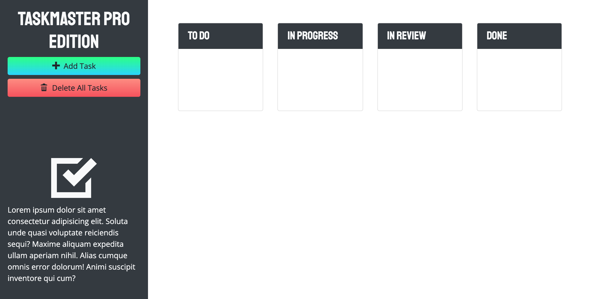

# TaskMaster Pro Edition
  
  

## Summary

Taskmaster Pro is an organizational tool that allows the user to create tasks with descriptions and due dates.

The purpose of this project was to learn more about third-party APIs through utilizing several open source libraries including jQuery, jQuery UI, Bootstrap and Moment.js.

## Deployment
https://katiechurchwell.github.io/taskmaster-pro/

## Demo/Screenshot

## Questions
  If you have any questions about this project, please open an issue or use the contact information below:
  * [katiechurchwell](https://www.github.com/katiechurchwell)
  * [churchwellcatherine@gmail.com](mailto:churchwellcatherine@gmail.com)

---
  